# Research Roadmap & TODOs

## 📅 Timeline Overview

```mermaid
gantt
    title Research Project Timeline
    dateFormat  YYYY-MM-DD
    axisFormat  %a-%d
    
    section 🏗️ Foundation
    Code Implementation (VAE/SAE/Runners) :active, code, 2024-12-13, 2024-12-15
    Feature Selection (BAF Dataset)       :active, feats, 2024-12-13, 2024-12-15

    section 🧪 **Pilot**
    Small Scale Validation                :crit, pilot, after code, 3d

    section 🔍 Latent Size
    Research Optimal Size Metrics         :r_size, after pilot, 4d
    Find Optimal Size                     :imp_size, after r_size, 3d

    section 🧠 Sparsity & Interp
    Neuron Sampling & LLM Integration     :llm_dev, after imp_size, 5d
    Sparsity Impact Analysis :an_sparse, after llm_dev, 5d

    section 🚀 Scaling
    Full BAF Feature Scale-up             :scale, after an_sparse, 5d
```

## 📝 Detailed Task List

### 🏗️ Foundation: Implementation & Setup
**Goal:** Complete core codebase and feature selection by **Sunday, Dec 15**.

- [ ] **Data Loaders**
  - [x] Implement `TabularDataLoader` class
  - [ ] Validate `TabularDataLoader` class with BAF on a subset of features
- [ ] **Core Models**
  - [x] Implement `VAE` class
  - [ ] Validate `VAE` class
  - [ ] Implement `SAE` class
  - [ ] Validate `SAE` class
- [ ] **Training Infrastructure**
  - [ ] Implement Runners/Trainers
  - [ ] Create training scripts
- [ ] **Data Prep**
  - [ ] Analyze BAF (Bank Account Fraud) columns
  - [ ] Select initial "Small Feature Set" for Pilot
  - [ ] Select full feature candidates for later

---

### 🧪 Direction 1: Small Scale Pilot
**Goal:** Validate the pipeline works end-to-end on a manageable subset of data.

- [ ] Create `SmallFeatureDataset` config
- [ ] Train VAE on small subset
- [ ] Train SAE on VAE latents (small subset)
- [ ] Verify basic reconstruction works

---

### 🔍 Direction 2: Optimal Latent Size Discovery
**Goal:** Automatically determine the "perfect" SAE latent size instead of guessing.

- [ ] **Research**
  - [ ] Find metrics to validate latent capacity
  - [ ] Literature review on SAE sizing
- [ ] **Implementation**
  - [ ] Implement auto-sizing search algorithm
  - [ ] Validate metric correlation with quality

---

### 🧠 Direction 3: Sparsity & Interpretability
**Goal:** Understand impact of sparsity (Average Active Neurons) on concept quality.

- [ ] **Tooling**
  - [ ] Implement Neuron Sampler (capture activations)
  - [ ] Build LLM Interface (for description generation)
  - [ ] Implement Evaluation Metrics (Reconstruction vs. Interpretability)
- [ ] **Experiments**
  - [ ] Sweep different L0 (Sparsity) coefficients
  - [ ] Generate descriptions for neurons at each L0
  - [ ] Analyze trade-off: Reconstruction Error vs. Concept Quality

---

### 🚀 Direction 4: Full Scale Validation
**Goal:** Apply findings to the rich, high-dimensional BAF dataset.

- [ ] Refactor dataloaders for full feature set
- [ ] Run "Optimal Size" search on full dataset
- [ ] Perform full Sparsity/Interpretability analysis
- [ ] Final Report/Validation
